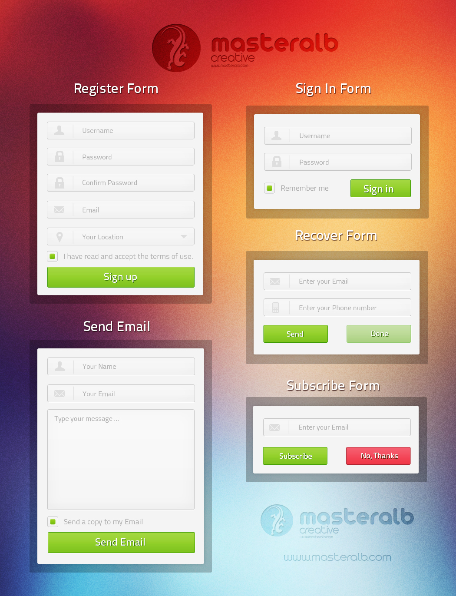

# Form CSS training

This is a solution to the Weekly Webdev Challenge.

## Overview

### Screenshot

### Links

- Solution URL: [Github](https://ggoliwas.github.io/form-css-training/)
- Live Site URL: [Live demo](https://github.com/ggoliwas/form-css-training)

## My process

### Built with

- Semantic HTML5 markup
- CSS custom properties
- HTML Forms
- CSS BEM Methodology 

## Author

- LinkedIn - [@Grzegorz Goliwąs](https://www.linkedin.com/in/ggoliwas/)
- GitHub - [@ggoliwas](https://www.your-site.com)
- Frontend Mentor - [@ggoliwas](https://www.frontendmentor.io/profile/ggoliwas)

